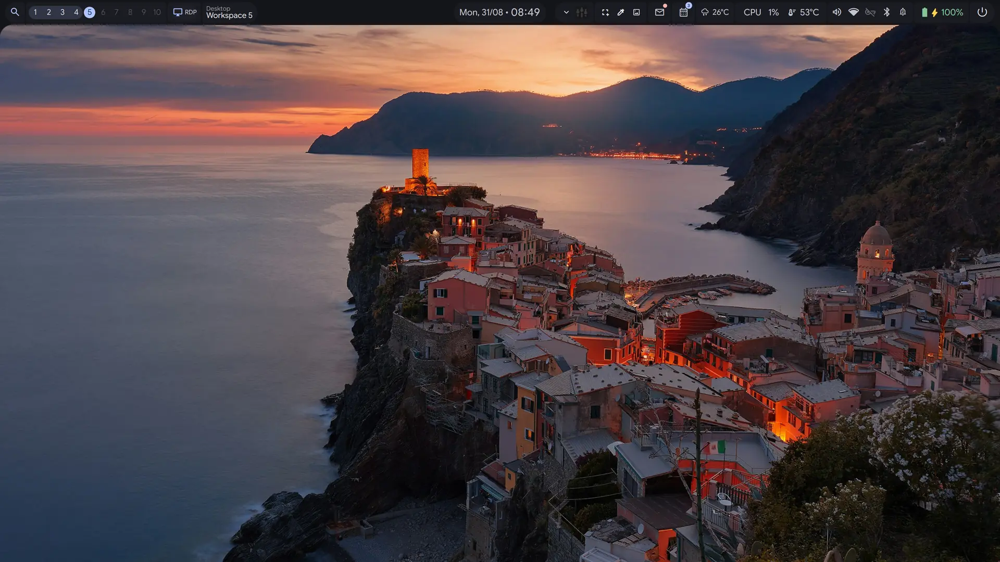
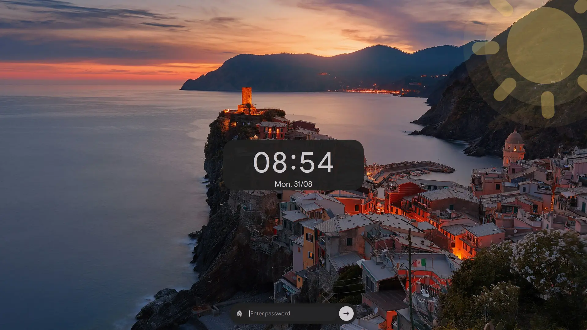
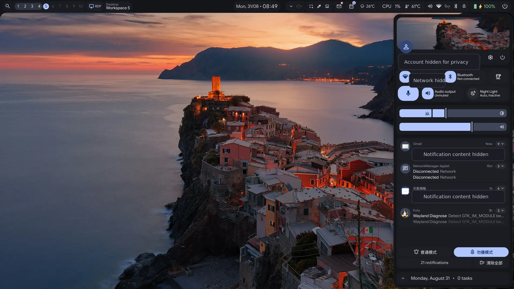

<div align="center">

# 💠 end4-pC

**[illogical-impulse](https://github.com/end-4/dots-hyprland)（作者：[@end-4](https://github.com/end-4)）の個人フォーク**
**pctrade** がカスタマイズおよびメンテナンス

[English](README.md) | [简体中文](README.zh-CN.md) | [日本語](README.ja.md)

</div>

> [!IMPORTANT]
> このディレクトリは desktop-ui に同梱された変更済みのスナップショットです。
> 元となるのは
> [pctrade/end4-pC commit `369554b62de8d659875de828c779b83b28ae9ada`](https://github.com/pctrade/end4-pC/commit/369554b62de8d659875de828c779b83b28ae9ada)
> です。2026-08-31 時点の desktop-ui による変更を含み、無変更の公式上流版ではありません。

---

## 🎬 紹介動画

<p align="center">
  <a href="https://www.youtube.com/watch?v=o0Vsh7eVchs">
    
  </a>
</p>

</div>

---

## 📸 スクリーンショット
<div align="center">

| デスクトップ | ロック画面 |
|:---:|:---:|
|  |  |
| 通知 | |
|  | |

</div>

これらは desktop-ui の下流統合を実際に撮影したものです。出典とマスキングの記録は
[`assets/showcase/README.md`](../../assets/showcase/README.md) を参照してください。

---

## ⚡ インストール

> [!IMPORTANT]
> このディレクトリは desktop-ui に同梱されたコンポーネントであり、単独で
> インストールするものではありません。上流リポジトリを使用中の Quickshell
> 設定へ直接 clone せず、リポジトリのルートからプロジェクトの
> [Quick start](../../README.md#quick-start) に従ってください。インストーラーは
> 既定でドライランとなり、バックアップと非公開オーバーレイについて説明します。

---

### ⚙️ 設定用キーバインド

設定パネルを開くには、Hyprland の設定に次の内容を追加します。

```lua
hl.bind("SUPER + escape", hl.dsp.global("quickshell:settingsToggle"), {description = "Toggle settings"})
```

> **注意：** 設定は通常のウィンドウではなくオーバーレイパネルであるため、`Super + Q` では閉じられません。同じキーバインドで切り替えるか、`Escape` を押してください。

## 🙏 クレジット

このプロジェクトを実現してくださった皆さまに心から感謝します。

- **[@end-4](https://github.com/end-4)** — オリジナルの [dots-hyprland](https://github.com/end-4/dots-hyprland) / illogical-impulse シェルを作成。この dotfiles プロジェクトはまさに傑作です 🫡
- **[@gh0stzk](https://github.com/gh0stzk)** — 天気ウィジェットの実現に必要な天気 API 連携を提供 🙌
- **[@StarS2112](https://github.com/StarS2112)** — このフォークを紹介 🙌

---

<div align="center">

❤️ を込めて制作 — 自由にフォークして、自分だけのものを作ってください

</div>
